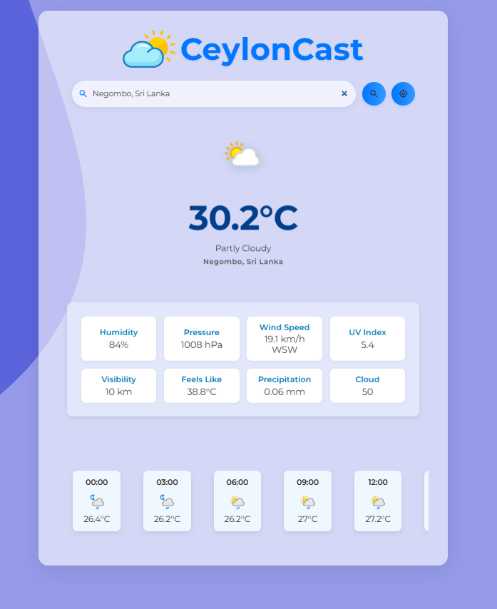

# CeylonCast

CeylonCast is a modern weather forecast web application built with React. It allows users to search for weather information by city or by their current location, and provides current weather details along with an interactive, horizontally scrollable forecast.

## Features

- **City Search:** Search for weather by entering a city name.
- **Location Weather:** Get weather for your current location using geolocation.
- **Current Weather:** Displays temperature, weather condition, and location.
- **24-Hour Forecast:** Horizontally scrollable hourly forecast for the next 24 hours.
- **Responsive Design:** Clean, modern UI that works on desktop and mobile.
- **No Results Handling:** Friendly message and image if no results are found.

## Screenshots

 

## Getting Started

### Prerequisites

- [Node.js](https://nodejs.org/) (v16 or higher recommended)
- [npm](https://www.npmjs.com/) 

### Installation

1. **Clone the repository:**
   ```sh
   https://github.com/isharaU/CeylonCast.git
   cd ceyloncast
   ```

2. **Install dependencies:**
   ```sh
   npm install
   ```

3. **Set up your WeatherAPI key:**
   - Create a `.env` file in the root directory.
   - Add your API key:
     ```
     VITE_API_KEY=your_weatherapi_key_here
     ```
   - You can get a free API key from [WeatherAPI.com](https://www.weatherapi.com/).

4. **Start the development server:**
   ```sh
   npm run dev
   ```

5. **Open your browser and visit:**
   ```
   http://localhost:5173
   ```

## Project Structure

```
src/
  assets/            # Images and icons
  components/        # React components (Search, CurrentWeather, HourlyForecast, NoResults)
  hooks/             # Custom React hooks (useWeather)
  utils/             # Utility functions (weatherService)
  index.css          # Main stylesheet
  App.jsx            # Main app component
  main.jsx           # Entry point
public/
  index.html         # HTML template
```

## Customization

- **Styling:** All styles are in `src/index.css`. You can adjust colors, fonts, and layout as needed.
- **Icons:** Weather icons are stored in `src/assets/`. You can replace them with your own.

## Deployment

You can deploy this app to any static hosting service (Vercel, Netlify, GitHub Pages, etc.) after building:

```sh
npm run build
```

## License

This project is MIT Licensed.

---


